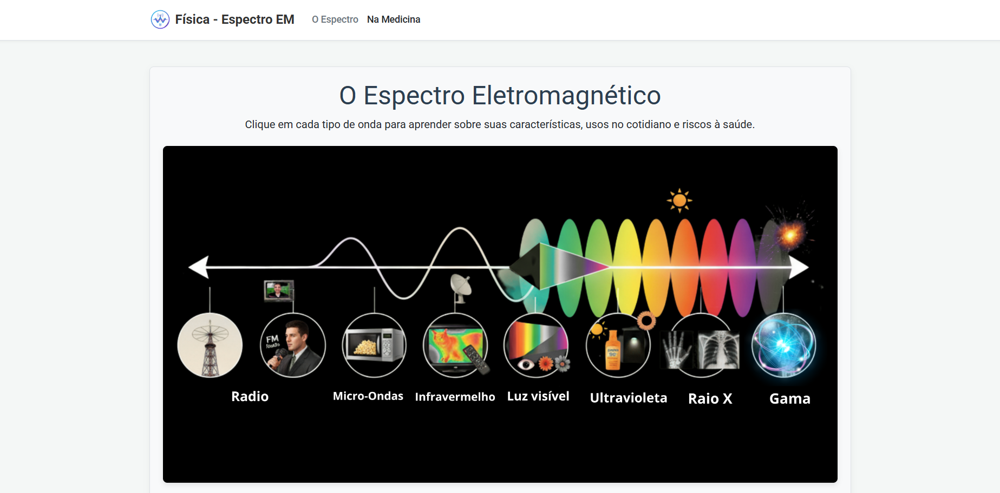

<h1 align="center">
   
  
   
  Espectro Eletromagnético & Medicina
   
</h1>

<h4 align="center">Um guia interativo sobre ondas eletromagnéticas e suas aplicações tecnológicas na saúde.</h4>

  <a href="#-sobre-o-projeto">Sobre</a> •
  <a href="#-funcionalidades">Funcionalidades</a> •
  <a href="#-tecnologias">Tecnologias</a> •
  <a href="#-conteúdo-físico">Conteúdo</a> •
  <a href="#-autora">Autora</a>

  
  

---

 
  
  

---

## 📖 Sobre o Projeto

Este projeto foi desenvolvido como instrumento avaliativo para a disciplina de **Física** e **SENAI** (Novo Ensino Médio). O objetivo é apresentar de forma didática e visual o **Espectro Eletromagnético**, diferenciando radiações ionizantes de não ionizantes e explorando profundamente seus usos na medicina diagnóstica e terapêutica.

O site foi construído com foco na experiência do usuário, responsividade e precisão científica.

## ✨ Funcionalidades

* **Mapa Interativo do Espectro:** Botões dinâmicos que classificam as ondas em Ionizantes e Não Ionizantes.
* **Modais Informativos (Pop-ups):** Ao clicar em uma onda (ex: Raios-X), uma janela se abre com:
    * Definição teórica.
    * Dados quantitativos precisos (Frequência, Comprimento de Onda, Velocidade).
    * Imagens ilustrativas de uso cotidiano.
* **Seção Médica Detalhada:** Explicações aprofundadas sobre o funcionamento físico de:
    * Ressonância Magnética (Ondas de Rádio + Magnetismo).
    * Tomografia Computadorizada (Raios-X).
    * Radioterapia (Raios Gama).
* **Alertas de Segurança:** Destaque para riscos à saúde e medidas de proteção (ex: uso de chumbo, dosimetria).

## 🛠 Tecnologias Utilizadas

O projeto foi desenvolvido utilizando as seguintes tecnologias:

*  **HTML5 Semântico**: Estruturação do conteúdo.
*  **CSS3**: Estilização personalizada.
*  **Bootstrap 5**: Framework para layout responsivo, cards e modais.
*  **JavaScript**: Manipulação do DOM para injetar conteúdo dinâmico nos modais.

## ⚡ Conteúdo Físico Abordado

O site demonstra domínio sobre os seguintes conceitos:

| Grandeza Física | Aplicação Prática |
| :--- | :--- |
| **Frequência ($f$)** | Diferenciação entre Rádio (baixa) e Gama (alta). |
| **Comprimento de Onda ($\lambda$)** | Relação inversa com a frequência. |
| **Ionização** | Riscos de danos ao DNA vs. Segurança térmica. |
| **Ressonância Magnética** | Alinhamento de prótons de hidrogênio. |
| **Tomografia** | Penetração diferencial de tecidos por Raios-X. |

## 🎓 Créditos Acadêmicos

* **Escola:** Escola SESI CE 368
* **Ano:** 2º Ano do Ensino Médio
* **Disciplina:** Física / Desenvolvimento de Sistemas (SENAI)
* **Data:** Novembro/2024

## 👩‍💻 Autora

<a href="[https://github.com/SEU_USUARIO_AQUI](https://github.com/Yasmin-Gabrielli)">
 
  
 <b>Yasmin Gabriélli</b>
</a>

 

Feito com 💜 e muita Física!
